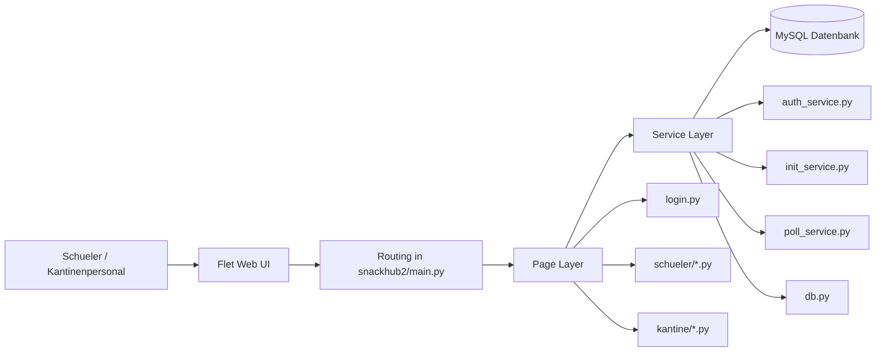
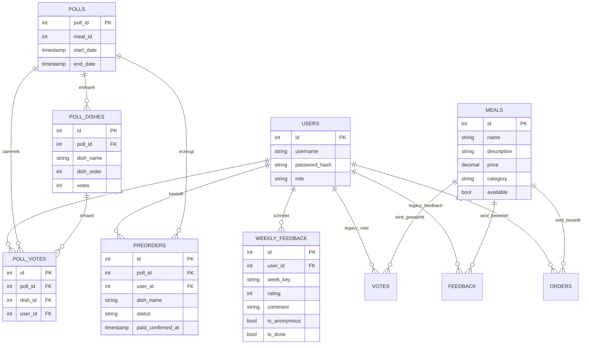

# Technische Dokumentation

Dieser Abschnitt beschreibt die technische Struktur von SnackHub mit Fokus auf
Architektur, Datenmodell und zentralen Anwendungskomponenten.

## Systemarchitektur

SnackHub ist als Python-basierte Webanwendung mit Flet im Frontend und MySQL
als persistenter Datenhaltung aufgebaut. Die fachliche Logik ist ueber eine
klare Trennung von Seiten, Services und Datenzugriff organisiert.

## Architekturkomponenten

| Ebene | Verantwortung | Relevante Dateien |
| --- | --- | --- |
| Einstieg | Start, Routing, Flet-Konfiguration | `snackhub2/__main__.py`, `snackhub2/main.py` |
| UI / Pages | Rollenbasierte Ansichten und Interaktion | `snackhub2/pages/...` |
| Komponenten | Wiederverwendbare UI-Bausteine | `snackhub2/components/header.py` |
| Services | Authentifizierung, Initialisierung, Voting-Logik | `snackhub2/services/...` |
| Persistenz | Verbindungspool und SQL-Zugriff | `snackhub2/services/db.py` |
| Setup | Datenbankschema und Seed-Daten | `snackhub2/setup_db.py` |

## Datenbankmodell

Die Datenbank `schul_kantine` bildet sowohl Benutzer- und Menudaten als auch
Voting-, Vorbestell- und Feedbackprozesse ab.

## Kernklassen und Kernfunktionen

### Authentifizierung

| Element | Aufgabe |
| --- | --- |
| `AuthService.hash_password()` | Hashing neuer Passwoerter mit `bcrypt` |
| `AuthService.check_password()` | Verifikation gespeicherter Passwort-Hashes |
| `AuthService.login_user()` | Login anhand Username + Passwort, Rueckgabe eines Domainenobjekts |
| `AuthService.register_user()` | Anlegen neuer Nutzer mit Rollenpruefung |

### Datenbank und Initialisierung

| Element | Aufgabe |
| --- | --- |
| `get_conn()` | Zugriff auf den MySQL-Connection-Pool |
| `initialize_app()` | Vorabpruefung, ob alle benoetigten Tabellen/Spalten vorhanden sind |
| `setup_database()` | Vollstaendiger Setup-Lauf fuer Schema und Testdaten |

### Fachlogik

| Bereich | Beschreibung |
| --- | --- |
| Voting | Erstellen, Anzeigen, Auswerten und Beenden von Abstimmungen |
| Menuverwaltung | Pflege sichtbarer Artikel fuer den Schueler-Shop |
| Vorbestellung | Ueberfuehrung von Poll-Ergebnissen in Bestellvorgaenge |
| Feedback | Woechentliche Rueckmeldungen zur Angebotsqualitaet |

## Routing und Rollenlogik

Die Navigation wird zentral in `main.py` ueber `page.route` gesteuert.

| Route | Rolle | Funktion |
| --- | --- | --- |
| `/` | Alle | Landingpage |
| `/login` | Alle | Anmeldung |
| `/register` | Alle | Registrierung |
| `/dashboard` | Schueler | Schueler-Dashboard |
| `/shop` | Schueler | Shop / Speisekarte |
| `/voting` | Schueler | Abstimmen |
| `/feedback` | Schueler | Feedback erfassen |
| `/vorbestellen` | Schueler | Vorbestellung |
| `/kantine_landing` | Kantine | Kantinen-Dashboard |
| `/voting_kantine` | Kantine | Abstimmung verwalten |
| `/menu_kantine` | Kantine | Menuepflege |
| `/feedback_overview` | Kantine | Feedback auswerten |
| `/vorbestellungen_kantine` | Kantine | Vorbestellungen einsehen |

## Wartbarkeit und Erweiterbarkeit

- Die UI ist in fachlich getrennte Seitenmodule aufgeteilt.
- Services kapseln fachliche Logik, damit UI-Code schlank bleibt.
- Das Setup-Skript enthaelt Migrationen fuer fehlende Tabellen und Spalten, was den Betrieb robuster macht.
- Die dokumentierte Trennung erlaubt spaeter den Austausch einzelner Layer, z. B. ein alternatives Frontend.
